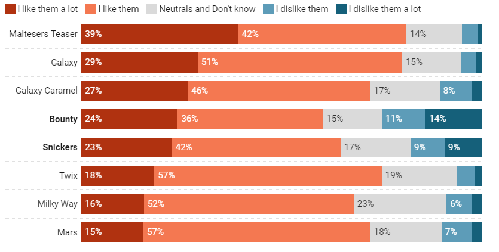
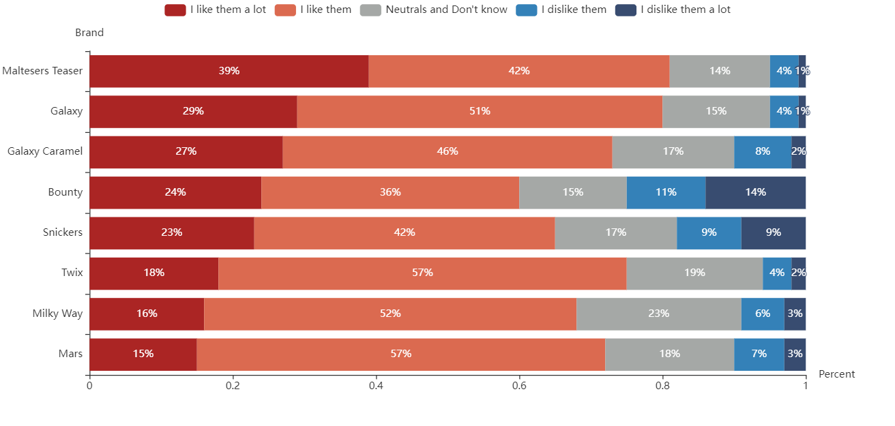
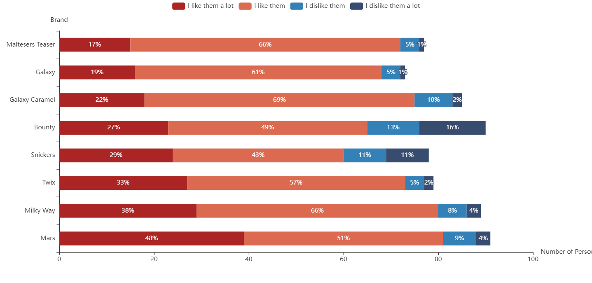
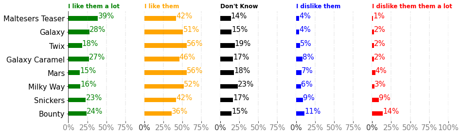
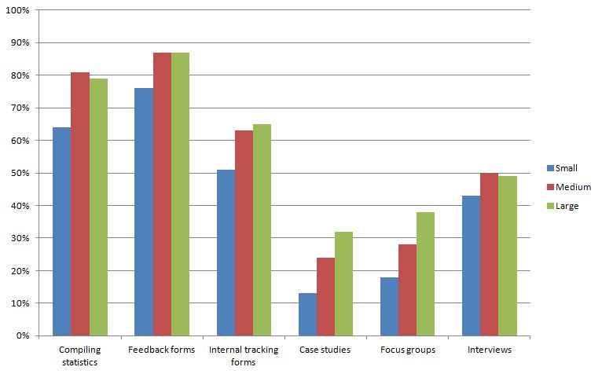
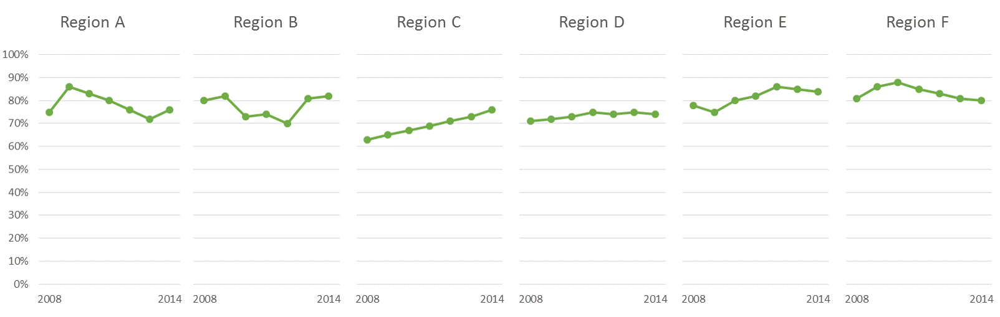
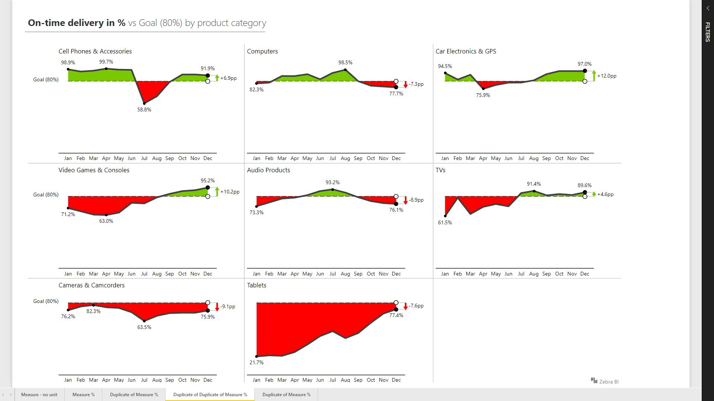
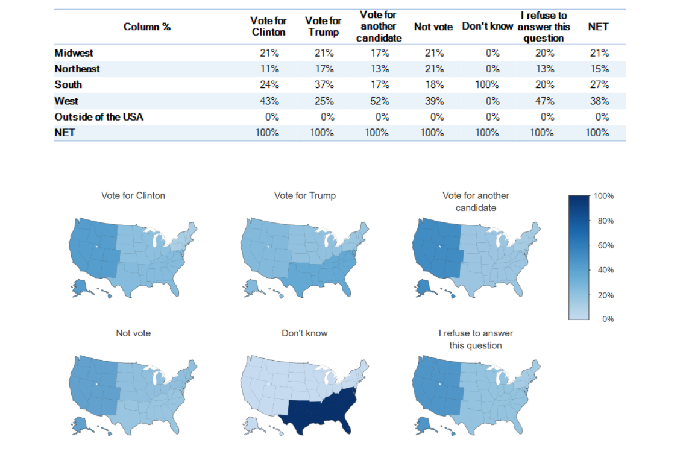
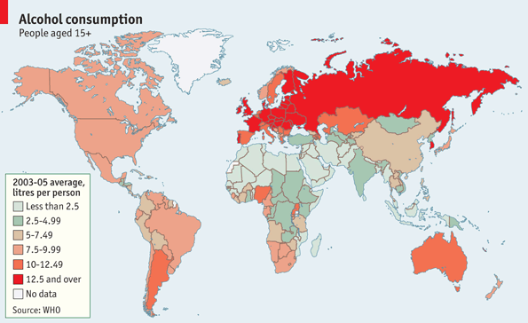

# **Disorganized data? Group, Group, Group!**

# Group members:
+ Student Name: Zexing Zhi    Student ID:320190940891
+ Student Name: Qiuchen Liu   Student ID:320190940271
+ Student Name: Shihang Li    Student ID:320190940151

# Abstract
In this article, we first introduce the importance of visualizations and our figure, then we introduce the figure that we choose and the reason why we choose this figure. After that, we replicate and improve this figure and describe the reasons for improvement. What is more, we discuss the applicable scenarios of different small multiples (Although the second graph of example 2 is not a small multiples, it can play a similar function to small multiples) and the limitations in different situations. There are many types of small multiples and many corresponding data types, This paper only selects several typical small multiples for analysis, including the horizontal and vertical axes of small multiples, the corresponding data characteristics of small multiples, and the last is conclusion.

# Introduction
## 1. Why information visualizations are important?

+ Information visualization is concerned with the design, development, and application of computer generated interactive graphical representations of information.
+ A good information visualization is one that can effetively convey the message to its readers.
+ A good visualization can help users to gain insights which includes:
   + Unexpected discoveries
   + Deeper understanding
   + New way of thinking
+ Data visualization can help people understand the data faster. The drafter can show the key points and information of the data in the picture according to the requirements or his own understanding.

## 2. Introduction of our graph
This picture is from [Datawrapper]("https://blog.datawrapper.de/weekly-chart-candy/"). The data shown in the figure are the preferences of the same population for different candies. When the number of people is determined, the focus of visualization should be the percentage of people who like different candy to varying degrees. This picture can well count and display this key point, that is, for the same type of statistical data (i.e. a certain total number of people), this picture can be used.

The figure below is the original figure:

## 3. Why choose this graph
Likert scale is a rating scale commonly used in surveys. When answering Likert type questions, respondents only need to state their degree of consent or disagreement on the symmetrical consent disagreement scale. The  choosen figure is a 100% stacked bar chart, which can well show the statistical data of Likert scale method. Although this figure is not a small multiples, it can play a similar function to small multiples, that is, displaying data in groups.

This is the figure we reproduced (If the background color of your reader is dark, please view this reproduced image in jupyter notebook.):

# Figure analysis

## 1. Analization of the graph:
+ Data Type
   + **X**: The cumulative percentage of people who like different sweets
   + **Y**: Different kinds of candy
+ Visual variables
   + Length of the color bar: Stands for the value of each preference
   + Colors: stands for people's different preferences

## 2. Highlights of the orginal image:
+ A 100% stacked bar chart keeps the part to whole nature of the data intact.
+ The selected color is clearly distinguishable.
+ The degree of preference decreases from left to right, which represents a good order.
+ The number physically measured on the surface of the graph itself is proportional to the number represented.
+ Clear, detailed and thorough labels eliminate graphic distortion and ambiguity.
+ If the focus of visualization is to emphasize the proportion of people who like different sweets, it will be a good visual image.

## 3. Disdvantages of the original drawing:
***Two disadvantages caused by the meaningless X axis:***
+ **Disadvantage 1**: If we want to know the number of people who ignore the other four attitudes other than the unknown attitude, it is difficult to meet this demand by using 100% stack bar chart, and this data can reflect the popularity of a certain candy to a certain extent. If the unit of the X axis is changed to the number of people, and the length of each line is different, the figure can have some more insight points.
+ **Disadvantage 2**: It is hard to compare the Neutrals or in our case, the Neutrals and Don’t know. This is because there is no common baseline for the middle values of a stacked bar chart. For the same reason, it is hard to compare the values for I like them and I dislike them. If I leave blank on both sides for different parts of each candy fruit, then center each color block and discard the abscissa, Then the vertical comparison will also become easy (Since the focus of visualization is to compare the proportions of different components, and the total length of each line is the same, there is no need to emphasize this insight point).

# Deal with the shortcomes

## 1. Figure's imporvement:
+ The first improvement method of the previous picture is: while retaining the percentage in each color block, locate the number of people on the x-axis, After clearing the data of "don't know" attitude, recalculate the percentages of the other four attitudes and display them in stack bar chart.
   + **Improve picture display:**

      This is the graph improved with the first method (If the background color of your reader is dark, please view this reproduced image in jupyter notebook):
      
   + **Why to change like this?**
      + This change can not only provide the proportion information in the original figure, but also can see the popularity of each candy according to the length of each bar. These data can reflect the popularity of each candy to a certain extent, so as to further obtain information for the future market layout.
   + **In what scenario is this diagram suitable for use?**
      + This method can be used when the data can be grouped twice and there is a holistic relationship between different elements in a group(the original image data can be grouped according to the candy type or the degree of preference).

+ The second improvement method is to change the original image to small multiples with Y-axis as candy type and X-axis as 0-100%. Different attitudes are displayed separately. The baseline of each subgraph is 0% and is on the left side of the subgraph.
   + **Improve picture display:**
      This is the graph improved with the second method (If the background color of your reader is dark, please view this reproduced image in jupyter notebook):
      
   + **Why to change like this?**
      + Such a change can more clearly see the results of the vertical comparison while retaining the horizontal comparison (the percentage in the color block is retained to make the horizontal comparison easy), , and it is easy to read individual values well as each of them are in a seperate bar chart.
   + **In what scenario is this diagram suitable for use?**
      + When the data can be grouped twice and the comparison between each group is very important, the effect will be very good. Add 0-100% X-axis in the interval of each color zone to convert it into a small multiples.

## 2. Work summury
Although the original and improved diagrams are not all small multiples, these diagrams play the same role as small multiples from the perspective of visualization. This lead us to think further. When is it appropriate to use small multiples?
+ **Data part:** The dataset needs to be grouped twice.
+ **Logic part:** Each grouping way is meaningful to the users.

Small multiples is a very good visualization method, but using small multiples also has its limitations.
+  When using small multiples, there is often a coordinate axis facing all data. If the data proportion difference is too large (for example, the data range is [0.001-10000]) In this case, it is inconvenient to read the extreme values when using small multiples.

# More explorations of small multiples

## **Example 1:**
As shown below, the chart shows the percentage of small, medium and large non-profit organizations. Since there is only quantitative comparison relationship between different groups of data, there is no time sequence and overall relationship, the small multi chart of bar chart can be directly used for display.

[(The link to the next image)]("https://depictdatastudio.com/small-multiples-challenge/")

## **Example 2:**
As shown in the figure below, the chart shows the economic development level of different regions in recent years. Since the data contains a time sequence, it is appropriate to adopt the small multiples display method of broken line chart

[(The link to the next image)]("https://stephanieevergreen.com/declutter-dataviz-with-small-multiples/")

At the same time, the variant technique of line graph can also be applied to each graph in small multiples. If the data content is the graph corresponding to the stock growth rate, the growth rate will be positive or negative. If you want readers to have a more intuitive understanding of whether the stock is growing or falling, you can fill the part of the growth rate curve greater than 0 with red and the part less than 0 with green. Of course, the filling method is often not ideal when applied to big data. At this time, you can choose to draw the curve into different colors instead of considering filling.**The figure below is not a small multiples, but it can stand for a way to show your small multiples.**

[(The link to the next image)]("https://zebrabi.com/small-multiples-power-bi/")

## **Example 3:**
The following figure is a very interesting example of small multiples. It describes the voting rates of different candidates in different states in the United States. The coordinate axis shared by all data is the color bar on the right side of the picture. Due to the regional nature of the data, using the combination of map + color can more intuitively show the voting rate of different candidates in different states. Of course, the color indicates that the voting rate is often accompanied by a problem, that is, it is difficult to compare the parts with similar colors. Therefore, the drawing of this kind of map needs to properly process the data, and the data requirements are high. The rectangular tree graph is similar to this graph.

[(The link to the next image)]("https://www.displayr.com/what-are-small-multiples/")

## **Example 4:**
The following figure has a very obvious advantage over example 3. Instead of gradient colors, the color bar uses ladder colors. In this way, although it is impossible to compare the internal data represented by each color, it is very concise and clear. Another advantage is that you don't need to consider the span of data, because the color represented can be defined by yourself. For example, you can define 10 * * (- 5) level data as green, 10 * * (- 4) level data as blue, etc.. This method is also applicable to rectangular tree graph

[(The link to the next image)]("https://junkcharts.typepad.com/junk_charts/2014/02/small-multiples-with-simple-axes.html")

# Conclusion:
+ Reasonable use of small multiples can display data in a very organized way. In theory, as long as the data can be grouped twice, small multiples can be used for rendering. For which small multiples to use, you need to observe the grouping characteristics of the data to see whether it has integrity, sequence, locality or some other characteristics. Of course, the use of small multiples will have higher requirements on data. Observing the distribution characteristics of data is also a necessary step to choose whether to use small multiples.
+ Small multiples or similar visualization methods focus on concise and grouped display of data. Data between different groups also have the ability to compare with each other. However, if the data does not need to be compared between groups, it is unnecessary to use small multiples at this time.
+ In all, the use of small multiples for visualization depends on two aspects: 
   + one is the data level
      + Data distribution;
      + Whether the data can be grouped twice;
      + The relation of the data in each group.
   + the other is the story telling level 
      + Wether the comparison between groups is important
+ When data distribution is not conducive to visualization, it can be handled from two aspects:
   + The first aspect is the operation of data sets, which can map all data appropriately, and explain the mapping method in the visual  interface.
   + On the other aspect, it operates in the aspect of visualization. You can customize the visual mapping by using methods such as step color blocks.
